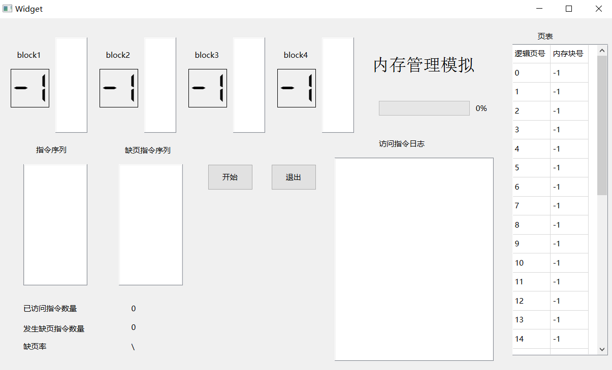
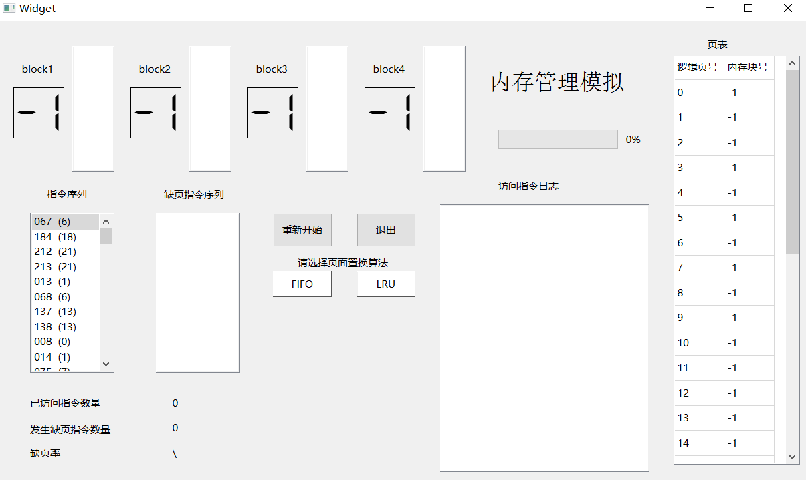
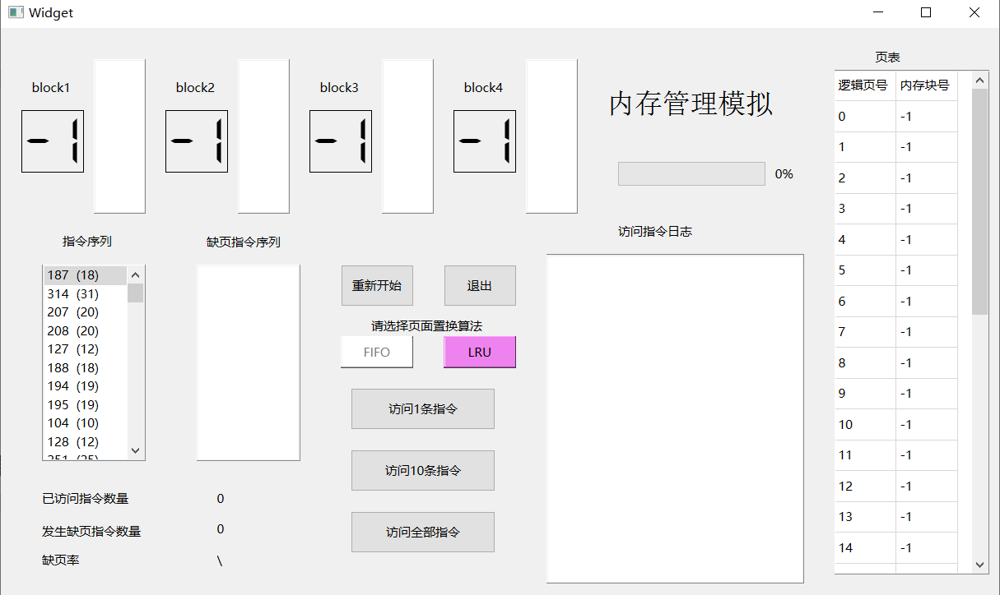
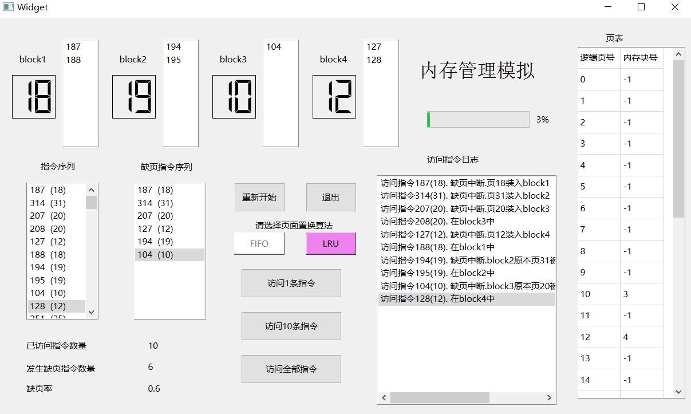
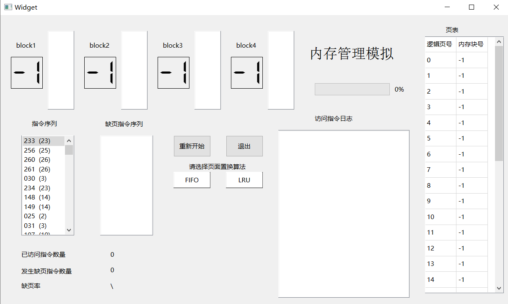

# 操作系统项目--内存管理

> 学号：1951593
>
> 姓名：李航宇
>
> 指导老师：张惠娟

[TOC]

## 1 项目目的

- 理解页面、页表、地址转换
- 理解页面置换过程
- 加深对请求调页系统的原理和实现过程的理解

## 2 开发环境

- 操作系统：Windows10
- IDE：Qt Creator
- 语言：C++
- 编译器：Qt 6.1.0 MSVC2019 64bit

## 3 项目需求

### 3.1 基本任务

假设每个页面可存放10条指令，分配给一个作业的内存块为4。模拟一个作业的执行过程，改作业有320条指令，即它的地址空间为32页，目前所有页都还没有被调入内存。

### 3.2 模拟过程

- 在模拟过程中，如果所访问指令在内存中，则显示其物理地址，并转到下一条指令；如果没有在内存中，则发生缺页，此时需要记录缺页次数，并将其调入内存。如果4个内存块中已装入作业，则需进行页面置换。

- 所有320条指令执行完成后，计算并显示作业执行过程中发生的缺页率。

### 3.3 指令访问次序

作业中指令访问次序可以按照下面原则形成：50%的指令是顺序执行的，25%是均匀分布在前地址部分，25％是均匀分布在后地址部分。

## 4 算法分析

当访问一条指令时，若此条指令所在页已经在内存中，则直接访问改指令。否则，出现了缺页中断，需要将该指令所在页装入内存，分两种情况：

1.若有内存块还未装入页，则将待访问指令所在页装入该内存块

2.若所有内存块都已经装入页，则根据置换算法将某个内存块中页换出，将待访问指令所在页装入此内存块。

置换算法可分为FIFO算法与LRU算法。

- FIFO算法

FIFO算法即先进先出算法，在需要置换时，置换出的是建立最早的页面。FIFO算法的流程图如下。


- LRU算法

LRU算法即最近最久未使用算法，在需要置换时，置换出的是最长时间没有使用的页。它的性能接近最佳算法。LRU算法的流程图如下。


## 5 具体实现

### 5.1 产生指令

产生指令的过程如下：

1.随机取一条指令m

2.在0-m-1指令中中随机选取一条指令m1

3.执行指令m1与m1+1

4.在m1+1-319中随机选取一条指令m2

5.执行指令m2与m2+1

6.令m=m2，回到1

### 5.2 页面、页表、地址转换的实现

- **页面**：在项目中，产生了320条指令，对应指令序号为0-319。逻辑页号为`i`的页表存储的指令为`10*i-10*i+9`。在项目中，用一个数组`instruction`来记录这320指令，那么逻辑页号为`i`的页面其实就是对应`instruction[10*i]-instruction[10*i+9]`。
- **页表**：在现实应用中，页表中的一项包括页号、中断位、内存块号、外存地址、访问位、修改位。而在此次模拟项目中，没有考虑到外存地址，也没有考虑到修改，而只有被访问才被调入内存，故实际上只需要记录页号、内存块号（内存块号为-1代表没有装入内存）。在程序中，用`pageBlock[30]`这个数组来记录各页对应的内存块号。页表的结构如下图所示。
- 
- **地址转换**：指令号为`i`的指令逻辑地址的逻辑页号为`i/10`，对应的页面偏移量为`i%10`。若所在页面已被被装入内存块，其块号为`j`，那么其物理地址的物理页号为`j`，页面偏移量为`i%10`。

### 5.3 FIFO算法置换的具体实现

在用FIFO算法置换出页面时，需要置换出的是最先装入内存的页面，这要求记录各内存块对应页面的装入时间。事实上，我们只需知道这些装入时间的先后顺序，因此可以用优先级来代表装入时间的先后次序，优先级越大就表示装入时间越久。在程序中，用`statusFIFO[4]`这个数组来记录优先级。

在本项目中，内存块有4个，那么就可以用1，2，3，4分别代表装入时间的优先级。初始各内存块`statusFIFO`置为-1，表示没有页面装入。若访问指令时发生缺页中断，则不修改`statusFIFO`。当发生缺页中断时会修改`statusFIFO`，分两种情况：

1.不需要置换时，即还有内存块未装入页面，将新的页装入某个空内存块，此内存块`statusFIFO`置为1，其他已装入页的内存块`statusFIFO`分别都加1。

2.需要置换时，只需将内存块对应`statusFIFO`为4的页面置换出来，换入新的页后，将其`statusFIFO`置为1，将其他内存块对应`statusFIFO`分别都加1。

### 5.4 LRU算法置换的具体实现

用LRU算法置换出页面时，需要置换出的是最近未被使用的页面，因此需要记录各个内存块中页面最近被访问的时刻到当前时刻的时间间隔。在本项目中，这个时间间隔的基本单位是访问一条指令。在程序中，用`stausLRU[4]`这个数组来记录。

访问指令时分三种情况:

**1.未发生缺页中断**，将被访问指令对应内存块的`statusLRU	`置为0，其他已装入页的内存块的`statusLRU`加1。

**2.发生缺页中断，且不需要置换**。这只有在程序运行开始时会出现，此时将该指令所在页放入的内存块对应的`statusLRU`置为0，其他已经装入页面的内存块对应`statusLRU`加1。

**3.发生缺页中断，且需要置换**。此时找到`statusLRU`最大的内存块，将该内存块中页面换出，将被访问指令所在页装入该内存块，并该内存块`statusLRU`置为0。其他内存块对应`statusLRU`加1。

## 6 关键代码

### 6.1 FIFO算法访问一条指令

```c++
void Widget::OneStepFIFO(int inst){
    //检测当前指令是否放入内存
    for(int i=0;i<4;i++){
        if(block[i]==inst/10){
            setBlock(i,inst);
            return;
        }
    }
    //检测是否有空闲内存块,只有初始时才会出现此情况
    for(int i=0;i<4;i++){
        if(block[i]==-1){
            setBlock(i,inst);
            statusFIFO[i]=1;
            updateFault(inst);
            for(int j=0;j<4;j++){
                if(j!=i&&block[j]!=-1){
                    statusFIFO[j]+=1;
                }
            }
            return;
        }
    }
    //缺页中断，换出最先进入内存指令
    for(int i=0;i<4;i++){
        if(statusFIFO[i]!=4){
            statusFIFO[i]++;
        }else{
            setBlock(i,inst);
            updateFault(inst);
            statusFIFO[i]=1;
        }
    }
}

```

### 6.2 LRU算法访问一条指令

```C++
void Widget::OneStepLRU(int inst){
    //检测当前指令是否放入内存
    for(int i=0;i<4;i++){
        if(block[i]==inst/10){
            this->statusLRU[i]=0;//最近访问时间更新
            for(int j=0;j<4;j++){
                if(j!=i&&block[j]!=-1){
                    statusLRU[j]+=1;
                }
            }
            this->setBlock(i,inst);
            return;
        }
    }
    //检测是否有空闲内存块,只有初始时才会出现此情况
    for(int i=0;i<4;i++){
        if(block[i]==-1){
            setBlock(i,inst);
            statusFIFO[i]=1;
            updateFault(inst);
            for(int j=0;j<4;j++){
                if(j!=i&&block[j]!=-1){
                    statusLRU[j]+=1;
                }
            }
            return;
        }
    }
    //缺页中断，换出最近未被访问内存
    int maxIndex = 0;
    int maxTime = this->statusLRU[0];
    for(int i=1;i<4;i++){
        if(statusLRU[i]>maxTime){
            maxTime = statusLRU[i];
            maxIndex = i;
        }
    }
    for(int i=0;i<4;i++){
        if(i!=maxIndex){
            statusLRU[i]++;
        }else{
            setBlock(i,inst);
            updateFault(inst);
            statusLRU[i]=0;
        }
    }
}
```

## 7 测试结果与分析

分别以FIFO置换算法与LRU置换算法分别测试了10次（每次LRU算法与FIFO算法的指令序列都是随机产生的，共20次测试中指令序列都是不同的），缺页率结果如下。

|      | 1     | 2     | 3     | 4     | 5     | 6     | 7     | 8     | 9     |  10   | 平均  |
| ---- | ----- | ----- | ----- | ----- | ----- | ----- | ----- | ----- | ----- | :---: | ----- |
| FIFO | 0.475 | 0.468 | 0.45  | 0.478 | 0.481 | 0.422 | 0.444 | 0.456 | 0.450 | 0.459 | 0.458 |
| LRU  | 0.400 | 0.459 | 0.420 | 0.469 | 0.384 | 0.450 | 0.438 | 0.428 | 0.449 | 0.450 | 0.437 |

从测试结果可以看出，相对而言LRU置换算法缺页率较FIFO置换算法较少，但相差不多。

## 8 程序演示

### 8.1 初始界面



- 最上方一排是四个内存块的相关信息。其中LCD数字显示的是内存块装入的页的逻辑页号。
- 每个LCD数字右边的列表将会显示页面装入内存后，此页被访问过的指令。
- 指令序列与缺页指令序列中将会存放待访问指令与缺页指令。
- 访问指令日志中会显示访问每条指令时的相关信息，包括未发生中断时该指令所在内存块号，发生缺页中断时的相关信息。
- 左下角显示的是指令相关统计信息。
- 最右边显示的是当前页表。
- 访问指令日志上方的进度条显示当前已访问指令占全部指令的百分比。

### 8.2 操作说明

在初始界面中按下开始按钮后，会生成待访问指令序列，并提示选择页面置换算法，如下图所示。



选择一个置换算法后，按下对应按钮，会出现访问指令的三种选项。如下图所示。按下访问全部指令按钮后，访问所有指令序列中未被访问指令。



下图为程序执行过程中的一张截图。选择的页面置换算法为LRU算法，已经访问了10条指令，指令的访问信息被记录在访问指令日志中。

以block1为例，LCD中显示的数字为30，表示当前block1存放的页逻辑页号为18；左侧的列表中有187，188两项，表示从逻辑页号为18的页被装入block1以来，访问的逻辑页号为18的页中的指令有187，188.



按下重新开始按钮后，会生成新的指令序列，上一个指令序列的相关信息清空。如下图所示。



## 9 总结

本次项目模拟了操作系统中页式存储管理的机制，实现了LRU与FIFO置换算法，并将之可视化，在这个过程中体会到了逻辑地址与物理地址的转换，也加深了对于操作系统请求调页的过程及原理的理解。

但项目还存在着一些不足。产生指令序列的方法可能与实际中相差较大；此外，页表的设计可能过于简单（虽然项目给定的模拟要求也不需要复杂的页表结构）。如果有机会可能可以从这几个方面进行优化。

