# 操作系统项目--内存管理

> 学号：1951593
>
> 姓名：李航宇
>
> 指导老师：张惠娟

[TOC]

## 1 项目目的

- 理解文件中存储空间的管理
- 掌握文件的物理结构、目录结构和文件操作
- 实现简单文件系统管理
- 加深文件系统实现过程的理解

## 2 开发环境

- 操作系统：Windows10
- IDE：Visual Studio2019
- 语言：C#

## 3 项目需求

### 3.1 基本要求

再内存中开辟一个空间作为文件存储器，在其上实现一个简单的文件系统；退出这个文件系统时，需要该文件系统的内容保存到磁盘上，以便下次可以将其恢复到内存中来。

### 3.2 具体要求

- 文件存储空间管理可采取链接结构（如FAT文件系统中的显式链接等）或其他学过的方法。
- 空闲空间管理可采用位图或者其他方法。
- 文件目录采用多级目录结构，目录中项目应包含：文件名、物理地址、长度等信息。

### 3.3 文件系统提供的操作

格式化、创建子目录、删除子目录、显示目录、更改当前目录、创建文件、打开文件、关闭文件、写文件、读文件、删除文件。

## 4 数据结构设计

- 程序中分了两种文件类型，即文件夹`fileType.folder`与文本文件`fileType.txt`。
- 存储文件数据的物理结构为多级索引结构，有3级索引，直接索引、一级间接索引与二级间接索引。
- 目录结构采用的是树型目录，且不设置目录深度限制与单个目录下最多文件数限制。
- 文件访问方法采用的是文件寻址。为每一个文件夹与文本文件都定义了文件号`fileID`，每一个`fileID`唯一对应一个文件，`fileID`记录在文件控制块中，因此可以通过`fileID`找到对应文件。
- 采用了目录项分解法，将文件控制块分为两部分。即符号目录项与基本目录项。前者主要记录的是文件名与文件号，是目录树型结构中的各个结点；后者则记录文件其他信息，包括索引表、创建时间、修改时间等。
- 空闲的空间采用位图进行管理。

   ### 4.1 Block     

```C#
public class Block
{
    public char[] data;
    public Block()
    {
        data = new char[8];
        for (int i = 0; i < 8; i++)
            data[i] = '\0';
    }
}
```
上面是最小存储单元Block的部分定义代码。块被设为8个`char`的大小，而`C#`中`char`的大小为2个字节，因此一个块的大小为`16B`.

### 4.2 Storage

```c#
public class Storage
{
    public const int capacity = 1024 * 1024;
    public int currentPointer = 0;//指向当前块的指针
    public bool[] bitMap;//位图
    public Block[] blocks;//存储块数组
}
```

上面是`Storage`的部分定义代码，`Storage`类中的数据成员`bitMap`就是位图。在程序中会创建`Storage`类的一个实例`storage`，用于记录整个文件系统的存储空间使用情况，因此整个文件系统的最大存储空间为1024\*1024*16B=16MB。

### 4.4 FCB

```c#
public class FCB //文件控制块，其实是符号目录项
{
    public fileType type;
    public int fileID;
    public FCB parents = null;//父结点
    public FCB firstChild = null;//第一个子结点
    public FCB nextSibling = null;//下一个兄弟结点
}
```

上面是`FCB`的部分定义代码。事实上，这里的的`FCB`对应的是文件控制块中的符号目录项，三个`FCB`指针是用作将各个`FCB`组成树型结构。

### 4.5 FileInfo

```C#
public class FileInfo//文件信息类，相当于FCB中的基本目录项
{
    public IndexTable indexTable = new IndexTable();
    public string fileName;//文件名
    public string path;//文件路径
    public int size = 0;//文件大小，以B为单位
    public DateTime createTime;//文件创建时间
    public DateTime editTime;//文件最近修改时间时间
    public fileType type;//文件类型
    public int fileID;
}
```

上面是`FileInfo`定义的部分代码。事实上，这里的`FileInfo`对应的是文件控制块中的基本目录项，包含了一个文件的包括索引表在内详细信息。索引表的定义会在`4.6`中提到。

### 4.6 IndexTable

```C#
public class IndexTable //索引表
{
    public int fileID;
    public int[] directIndex;//直接索引
    public int directIndexNum;
    public int[][] primaryIndex;//一级间接索引
    public int primaryIndexNum_1;
    public int primaryIndexNum_2;
    public int[][][] secondaryIndex;//二级间接索引
    public int secondaryIndexNum_1;
    public int secondaryIndexNum_2;
    public int secondaryIndexNum_3;
}
```

上面是索引表`IndexTable`定义的部分代码，一个文件的索引信息都存在索引表中。对于各级索引采用数组的方式进行记录。直接索引采用一维数组记录，对应的块数最多为128；一级间接索引采用二维数组进行记录，对应的块数最多为128*128；二级间接索引采用三维数组进行记录，对应的块数最多为128\*128\*128。因此，一个文件最大为(128+128^2+128^3)\*16B = 32MB 258KB。

### 4.7 Catlog

```C#
public class Catalog //目录，每一项包括符号目录项（程序中为FCB）与基本目录项（程序中为FileInfo）组成
{
    public Dictionary<int, FileInfo> fileInfoTable;
    public Dictionary<int, FCB> FCBTable;
    public Storage storage;
    public int fileCount = 0;//已经创建的文件数目，将以此作为每个新文件的编号
    public int currentFolderID;//当前所在文件夹ID
}
```

上面是`Catalog`的部分定义。`Catalog`类主要实现的是目录的功能，每一项包括了符号目录项（程序中为`FCB`）与基本目录项（程序中为`FileInfo`）。此外，其数据成员还包括将记录全局的存储空间信息`storage`。`fileCount`记录的是已经创建的文件数目，每次创建文件时都用它来为新文件编号，这样可以避免文件号重复。`currentFoderID`记录的是当前所在文件夹文件号，这是为了显示当前文件夹而记录的，修改它再更新视图就可以较为方便地实现进入新文件夹、返回上一文件夹等功能。

## 5 部分重要功能实现说明

限于文档篇幅，这里不对于每个功能都做出详细解释只挑选部分重要的功能。

### 5.1 新建文件

```C#
public int createNewFile(fileType newFileType)//新建文件，并返回文件ID
{
	if (fileCount == 0)//建立第一个root文件夹,根结点为空
       {
            FCB newFCB = new FCB(fileCount, newFileType, null);
            FileInfo newFileInfo = new FileInfo(fileCount, newFileType, null);
            FCBTable.Add(newFCB.fileID, newFCB);
            fileInfoTable.Add(newFileInfo.fileID, newFileInfo);
       }
        else
        {
            FCB newFCB = new FCB(fileCount, newFileType, FCBTable[currentFolderID]);
            FileInfo newFileInfo = new FileInfo(fileCount, newFileType, fileInfoTable[currentFolderID]);
            FCBTable.Add(newFCB.fileID, newFCB);
            fileInfoTable.Add(newFileInfo.fileID, newFileInfo);
        }

        fileCount++;
        return (fileCount-1);
    }
```

上面是写文件操作的主要代码，新建一个文件时用户要选择是建立文件夹还是文本文件，系统会自动为新文件生成文件号`fileID`，再将新的文件对应的符号目录项`FCB`与基本目录项`FileInfo`加入到`FCBTable`与`fileInfoTable`中。

此外，要确定文件的相对关系，即将其加入到树型结构中。再程序开始运行时，会自动建立一个根文件夹（对应的fileID为0），由于根文件夹没有父文件夹，故需要对其进行特殊处理。

### 5.2 删除文件

```c#
public void deleteFile(int selectFileID) //删除文件
{
	FCB selectFCB = FCBTable[selectFileID];
    
	//在FCBTable中删除与此文件有关的关系
	FCB selectFileParents = selectFCB.parents;
	if (selectFileParents.firstChild == selectFCB)//当此文件为父文件夹下第一个文件
	{
		selectFileParents.firstChild = selectFCB.nextSibling;
	}
	else //不为父文件夹下第一个文件
	{
	FCB sibling = selectFileParents.firstChild;
	while (sibling.nextSibling != selectFCB)
	sibling = sibling.nextSibling;
	sibling.nextSibling = selectFCB.nextSibling;
	}

	List<int> deleteFileList = new List<int>();//待删除文件名单
	FCBTable[selectFileID].getAllChildFileID(deleteFileList);
	deleteFileList.Add(selectFileID);

    //释放空间
	List<int> releaseBlockIDs = new List<int>();
	foreach(int fileID in deleteFileList)
	{
		if (fileInfoTable[fileID].indexTable != null)
		{
			foreach(int releaseBlockID in 			fileInfoTable[fileID].indexTable.collectAllBlockIDs())
			{
				releaseBlockIDs.Add(releaseBlockID);
			}
		}
	FCBTable.Remove(fileID);
	fileInfoTable.Remove(fileID);
	}

	storage.releaseBlock(releaseBlockIDs);
}
```

以上是删除文件功能的主要代码。对于文本文件，删除它只要将其对应的`FCB`与`FileInfo`从`FCBTable`与`fileTable`中移除，并释放对应的内存块（修改位图），并修改目录树型结构。对于文件夹，则还需要删除它的所有子文件夹与子文件。因此，删除文件实际上是一个递归的过程，需要遍历所有相关文件，上述代码采用的是`DFS`进行遍历并删除相关信息的方法。

### 5.3 打开文件

```c#
private void listView1_DoubleClick(object sender, EventArgs e)//双击文件，进入文件夹或打开文件
{
    if (listView1.SelectedItems.Count == 0)
    {
    	return;//此时未选中任何文本，不作出反应
    }
    ListViewItem currentItem = new ListViewItem();
    currentItem = listView1.SelectedItems[0];//当前所选项
    int currentFileID = currentFolderTable[currentItem];//得到当前所选项对应fileID
    FCB currentFCB = catalog.FCBTable[currentFileID];
    FileInfo currentFileInfo = catalog.fileInfoTable[currentFileID];

    if(currentFileInfo.type == fileType.folder)//双击的是文件夹，则进入相应文件夹，并更新目录
    {
        currentFolderID = currentFileID;
        updateListView1();//更新当前文件夹下文件
        updateCurrentPath();//更新路径
    }
    else //双击文件，显示文件，进入文件编辑
    {
    FileEditArea fileEditArea = new FileEditArea();//文本编辑区域

    //若有此回调函数，则将进行修改文件
    fileEditArea.CallBack = (string newFileString) => { 
    //saveSign = true;
    this.catalog.editFile(currentFileID, newFileString);
    this.catalog.fileInfoTable[currentFileID].size = newFileString.Count() * 2;
    this.catalog.fileInfoTable[currentFileID].editTime = DateTime.Now;
    updateListView1();
    updateSizeLabel();
    };

    fileEditArea.label1.Text = currentFileInfo.fileName;
    fileEditArea.richTextBox1.Text = catalog.getFileString(currentFileID);

    fileEditArea.Show();
    }
}
```

上面是打开文件功能的主要代码。若打开的是文件夹，只需更新相应的当前目录下的视图。若打开地是文件，则相当于读文件，这时要通过索引表读出此文件数据对应的各个内存块，再将这些内存块中的数据拼接起来展示给用户。

### 5.4 写文件

```c#
public void editFile(int fileID,string newFileData)//编辑文件,相当于用newFileData替换对应文件中的原有内容
{
    //每次编辑文件相当于清空之前数据，再重新插入新的数据
    List<int> preBlockIDs = fileInfoTable[fileID].indexTable.collectAllBlockIDs();
    storage.releaseBlock(preBlockIDs);
    fileInfoTable[fileID].indexTable = new IndexTable();

    List<int> blockIDs = storage.allocateBlcok(newFileData);//将新数据装入存储块
    fileInfoTable[fileID].indexTable.addIndex(blockIDs);//将对应存储块数据放入新文件的索引表
}
```

每次进行写文件时，都相当于先释放原来文件占用存储空间，再为新的内容分配存储空间。

### 5.5 格式化

```c#
private void 格式化ToolStripMenuItem_Click(object sender, EventArgs e)
{
    if (MessageBox.Show("是否清除当前文件系统中所有数据?", "提示", MessageBoxButtons.YesNo) == DialogResult.No)
    	return;
    this.catalog = new Catalog();
    currentFolderTable = new Dictionary<ListViewItem, int>();
    currentFolderID = 0;
    catalog.createNewFile(fileType.folder);
    updateListView1();
    updateTreeView1();
    updateCurrentPath();
}
```

进行格式化的操作其实主要就是建立一个新的`Catalog`类实例，因此文件系统的所有信息，包括文件控制块与存储块的信息都记录在了`Catalog`中。

### 5.6 保存数据与加载历史数据

```c#
public void saveAlldata()//退出系统时保存所有数据,只要保存catalog中信息即可
{
	string path = System.IO.Path.GetDirectoryName(System.IO.Path.GetDirectoryName(System.AppDomain.CurrentDomain.BaseDirectory));//当前路径
     FileStream f = new FileStream(System.IO.Path.Combine(path, historyFileName), FileMode.Create);
     BinaryFormatter b = new BinaryFormatter();
     b.Serialize(f, catalog);
     MessageBox.Show("历史数据已保存至"+ System.IO.Path.Combine(path, historyFileName), "提示");
     f.Close();
}
        
public void loadHistoryData()//加载历史数据
{
	string path = System.IO.Path.GetDirectoryName(System.IO.Path.GetDirectoryName(System.AppDomain.CurrentDomain.BaseDirectory));//当前路径

    if (!File.Exists(System.IO.Path.Combine(path, historyFileName)))
    {
        MessageBox.Show("找不到历史数据文件"+ System.IO.Path.Combine(path, historyFileName) + " \n将新建文件系统!", "提示");
        return;
    }

    FileStream f = new FileStream(System.IO.Path.Combine(path, historyFileName), FileMode.Open,FileAccess.Read,FileShare.Read);
    BinaryFormatter b = new BinaryFormatter();
    catalog = b.Deserialize(f) as Catalog;
    f.Close();
}
```

保存文件系统所有信息与加载历史数据的功能主要是用到了`C#`中的`Serialize`与`Deserialize`方法。这两个方法可以存储对象的信息与从相应文件中恢复对象的信息。程序中`catolog`基本保存了文件系统的所有信息，因此只需要对`catalog`作相应操作即可实现保存数据与加载历史数据的功能。

### 5.7 其他功能

- 更新视图：程序中主要有两个视图。当前目录下的视图（可以看到当前目录下的文件）与树型视图（可以看到当前文件系统的树型结构）。当前目录下的视图可以由`Catalog`数据成员`currentFolderID`得到，它记录的是当前父文件夹的`fileID`，这样就可以根据树型结构找到当前视图中应该存在的文件。
- 修改文件名：只需修改`FileInfo`中的文件名信息。
- 计算文件大小：文本文件的大小可以直接由其保存的字符串长度得到。文件夹本身在文件中设定为不占空间，但由于其有子文件与子文件夹，计算其大小时需要将它们的大小相加，因此计算文件夹的大小也是一个递归的过程，程序中通过`DFS`来遍历计算。

## 6 程序演示

- 进入程序时，会提示是否加载历史数据


- 若找不到历史数据文件，将进行提示，并新建文件系统

  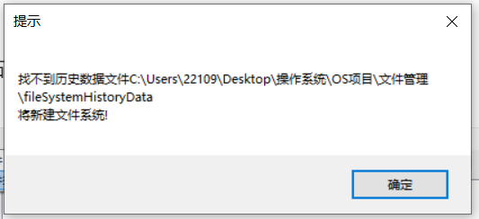

- 新建文件、格式化

  可以在选项中新建，也可以右键新建（此时当前目录下需要有文件）。

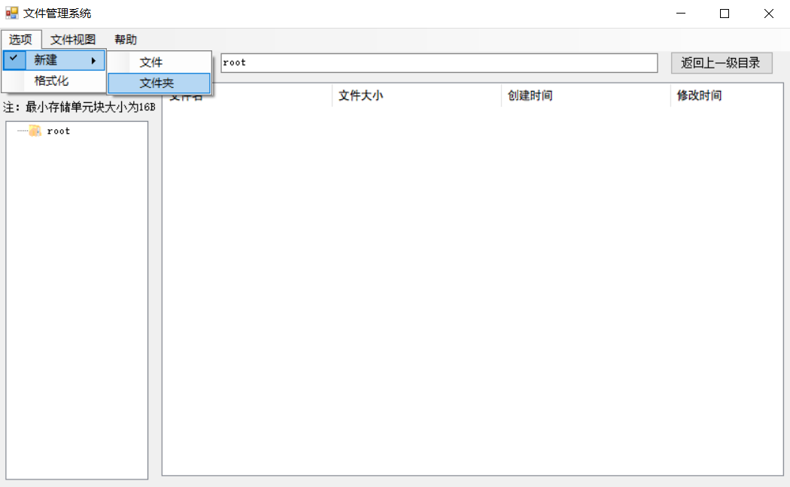

若选择格式化，会进行相应提示

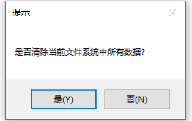

- 读写文件

双击文件，进入文本编辑框

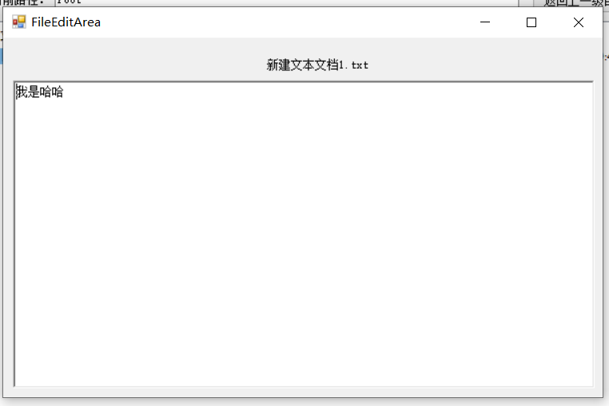

关闭文本编辑框，提示是否保存文件


- 重命名、删除文件

选中待操作文件，右键点击，出现删除、重命名选项。

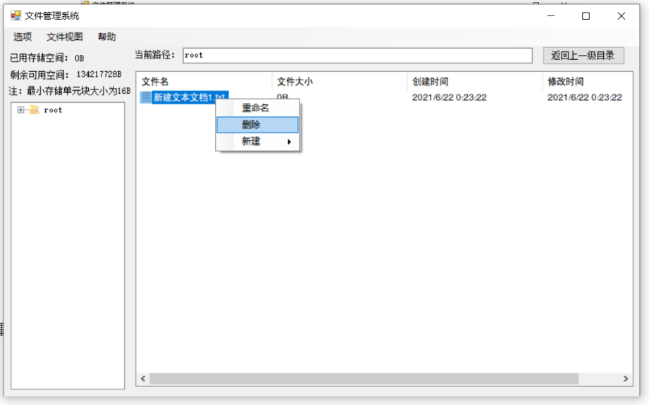

若选择重命名，会弹出重命名输入框

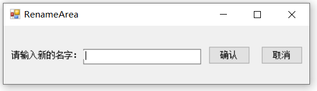

不能重命名相同文件夹下已有的其他文件名字

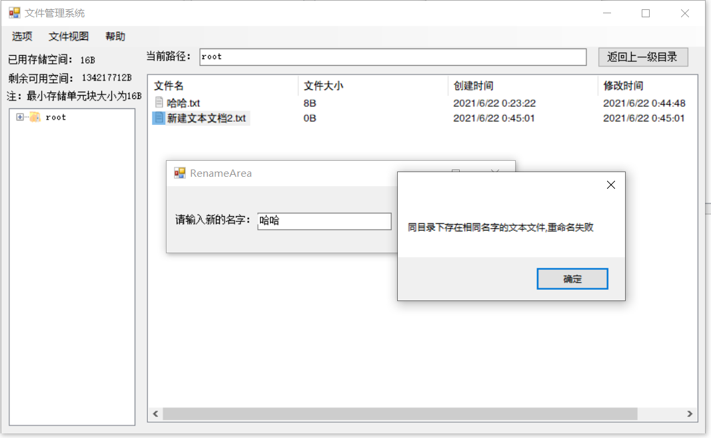

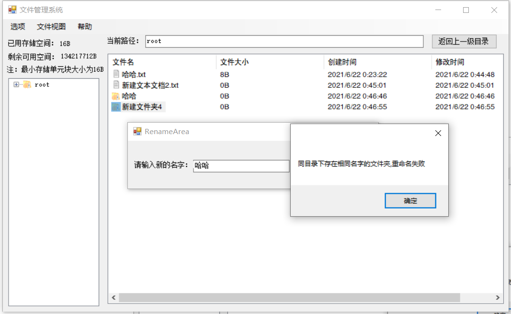

- 更改文件视图

Details视图

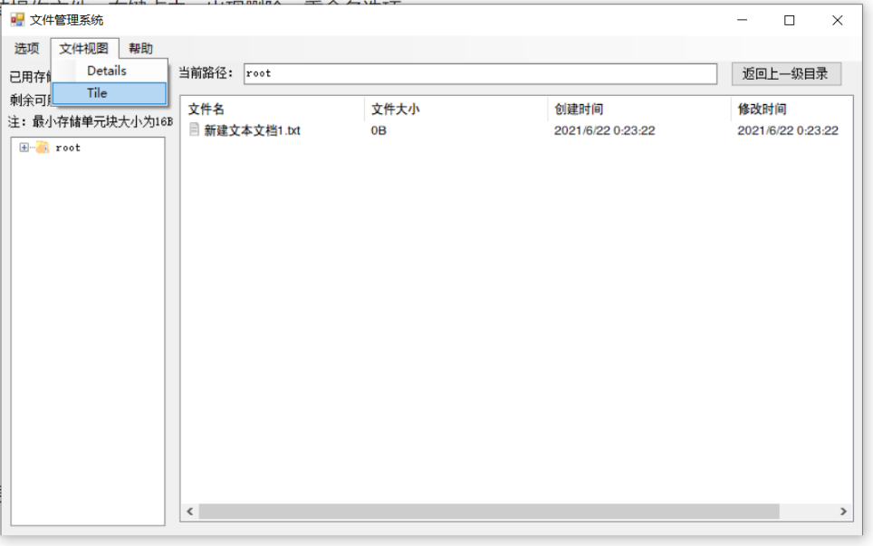

Tile视图

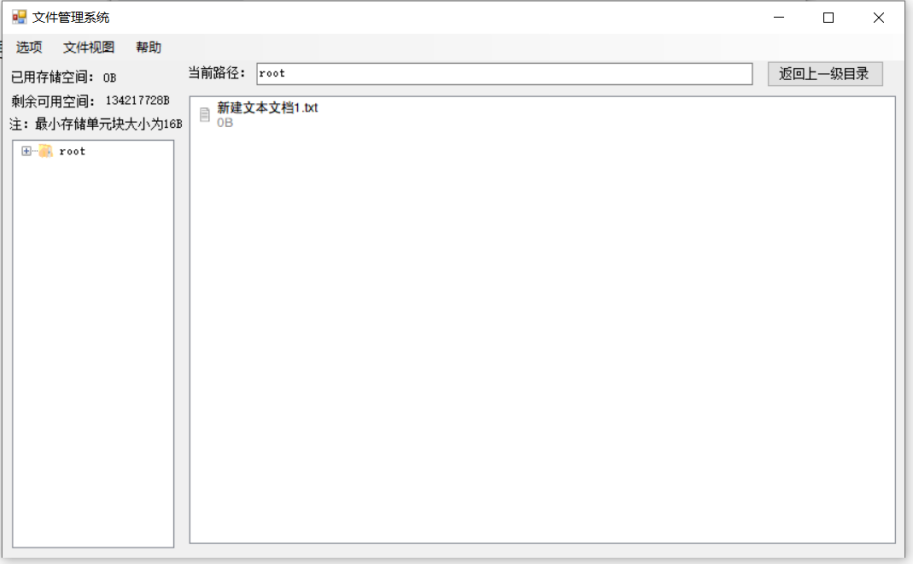

- 查看帮助文档

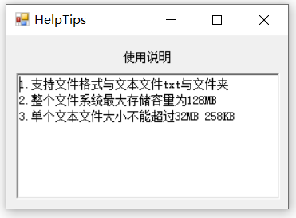

- 退出文件系统时提示保存数据

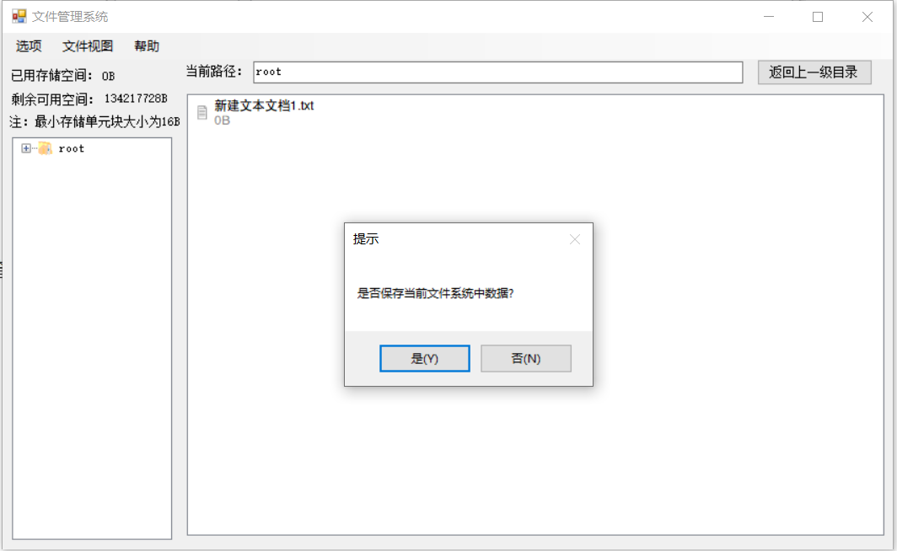

- 提示保存文件信息

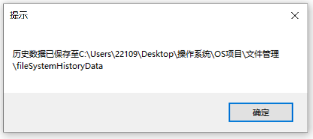

